This post is a review of the Analog Discovery 2 + LabVIEW Home Bundle in a lab environment. It was originally posted [here](https://www.element14.com/community/roadTestReviews/3075/l/analog-discovery-2-labview-home-bundle-review) as a part of element14's RoadTest. I thank element14 for sending me the review unit.

- **Evaluation Type:** Test Equipment

- **Was everything in the box required?:** Yes

- **Comparable Products/Other parts you considered:** ADALM1000,SainSmart DDS140,Hantek iDSO 1070A,Link Instruments MSO-28

- **What were the biggest problems encountered?:** Low power supply capability, coupling between Ch1 and Ch2 of the oscilloscope, it has bandwidth limitations and voltage input limitation, the device gets disconnected often(probably faulty cable)

  

## Detailed Review:

##### Typical Use case of LabVIEW in research labs.

Scientists around the world use LabVIEW and National Instruments products to design and control instruments. The lab that I currently work in does electrical and magnetic measurements of specific samples at liquid helium temperature (4 K). I wanted to interface all the instruments using LabVIEW. The system I'm using comprises of a Cryostat, Temperature controller, Source meter Unit. The cryostat uses a liquid helium compressor to cool down the chamber where the sample will be kept. The sample is kept on a sample holder that is designed in house, keeping in mind of all the sample space constraints and to maximise the thermal conductivity between cooler and the sample. An image of the sample holder with the sample can be seen here.

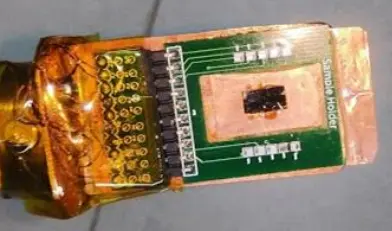

The sample you see is connected thermally to a heater and a temperature sensor (cernox sensor). Wires from the sample, temperature sensor and the heater come out of the cooler to a breakout box. One can connect any instruments to this break outbox using banana pin wires. Currently, Lakeshore 336 (LS336) temperature controller, B2912A Source meters (SMU) are connected in the photo below.

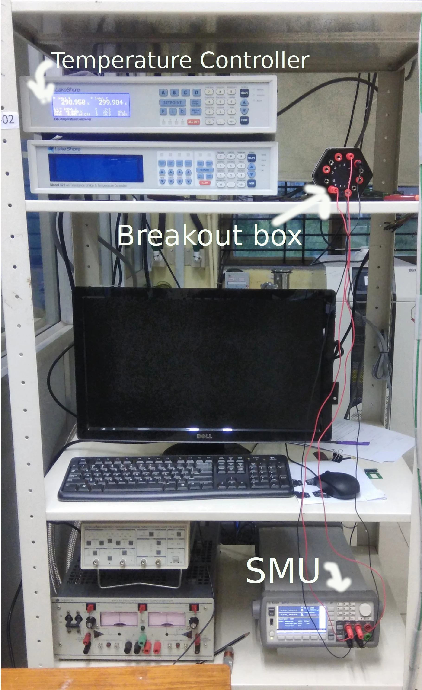

 

 

A schematic of the setup is

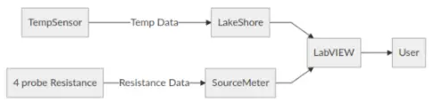

I wanted to use LabVIEW to make a program to automate data acquisition of resistance of the sample as a function of sample temperature.

 

In Labview, such software are what are called VI's which stands for virtual instrument. There are 2 parts to any VI, the front panel, where you put all the user-controllable elements like buttons tet bar etc and logical back panel/ where all the logic for the program is written using "G" programming language.

 

To get started with designing such software, typically one needs to install the instrumentation driver and look into example program. Luckily both LS336 and SMU had instrument drivers available.

Once installed, one can find example codes by going to HELP>FIND EXAMPLE> and searching the model number. In the case of LS336, "Lakeshore 336 Configure heater output control parameters and acquire single reading.vi" example was just what I needed. It had all the features I wanted to control from that instrument. Heres an image of that vi.

**Front Panel**

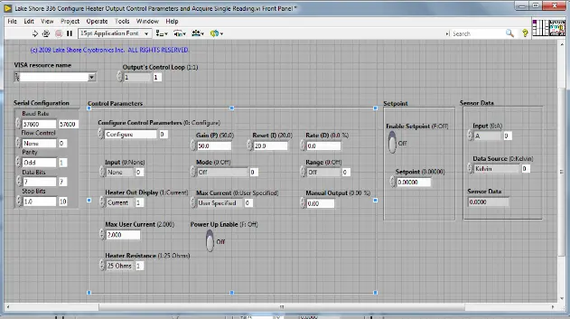

**Back panel**

 

Now, however, SMU's examples didn't work well for me, in such a case, one would make a new VI, right-click on the block diagram and go to

 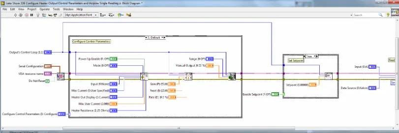

The back panel (block diagram) actually contain many sub-VI's that act as functions so one can use them in their own program. So, in the end, I combined parts from LS336's example and SMU's VI tree in a way that is suitable for the current requirement of measuring Resistance as a function of sample temperature. I also added functions to write the obtained data in a systematic format.

 

In the end, this is what was achieved.

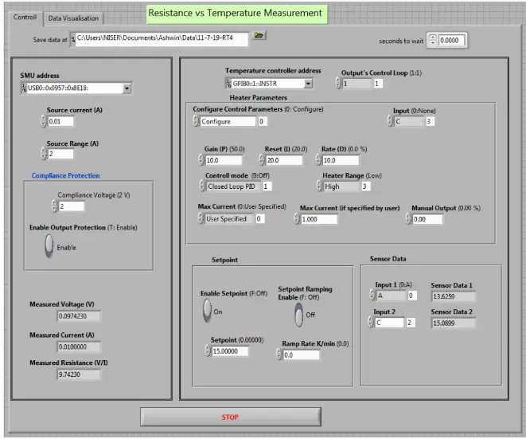

I would love to show you the block diagram but even 5 different images coudnt capture the entire block diagram (yes it was that messy!) so I have uploaded the source code at the end if anyone wants to take a look at it.

One of the better measurements I was able to do with this system was to measure superconducting transition temperature of Nb thin film, a graph of the same is attached here.

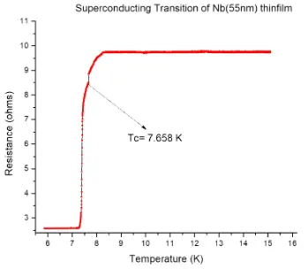

 

**A preliminary test of Analog Discovery 2!**

My main objective of using analog discovery(AD) is to build a vibration sample magnetometer (VSM) and use AD2 to source power and acquire measurements.

But before I show you how I did that, I can want to show few of the preliminary tests that I did with AD2, and show you where it succeeds and where it fails.

 

As a part of developing the sample holder for the above project, I designed 20 low pass RC filters. The PCB design and the fabricated PCB images :

[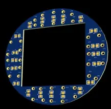](https://www.element14.com/community/servlet/JiveServlet/showImage/293607990-3075-737752/pastedImage_2.webp)[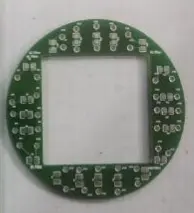](https://www.element14.com/community/servlet/JiveServlet/showImage/293607990-3075-737753/pastedImage_3.webp)

 

And in order to test them, I used the bode plot feature of AD2. The waveforms software that comes up with this device has a tab called Network analyser. The connections to the input and output side of the filter is connected as follows:e the WaveGen 1 output and Oscilloscope Channel 1 input of the device is connected to the filter input, while the Oscilloscope Channel 2 is connected to the filter output, as shown in the picture below. (taken from digilentinc.com)

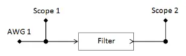

When the instrument is started, the bode plot is shown in the program and it was verified that the RC filters are working with the cutoff at 1KHz just as designed. A screenshot of the program is shown

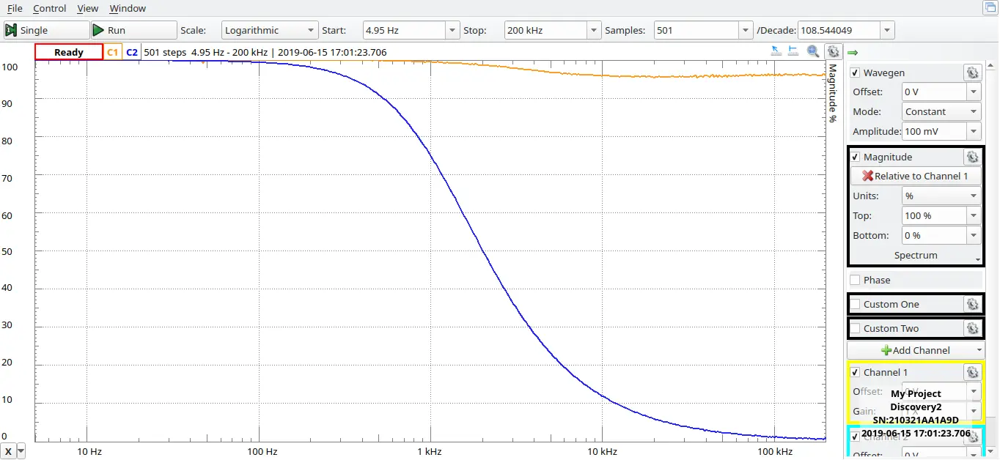

The RC filter was supposed to be used inside the cooler mentioned previously, so it would have to work at 4 K as well. But to our disappointment, at 4 K the cutoff shifted to 100KHz dues to high change in capacitance from 10uF to 12nF it is notable that the smd thin film resistor only changed values from 150ohm at room temperature to 160ohm. So the AD2 was an extremely handy tool. Typical lab network analysers are pretty expensive.

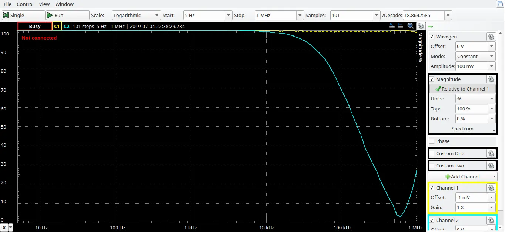

Another notable thing is that the AD2 gives unreliable results beyond 1MHz as can be seen in the above image.

I also noticed a coupling between Ch1 and CH2 of the oscilloscope, when WaveGen1 and Oscilloscope 1 wires were connected and wave gen was set to generate a random sine wave. This can be seen in the image below.

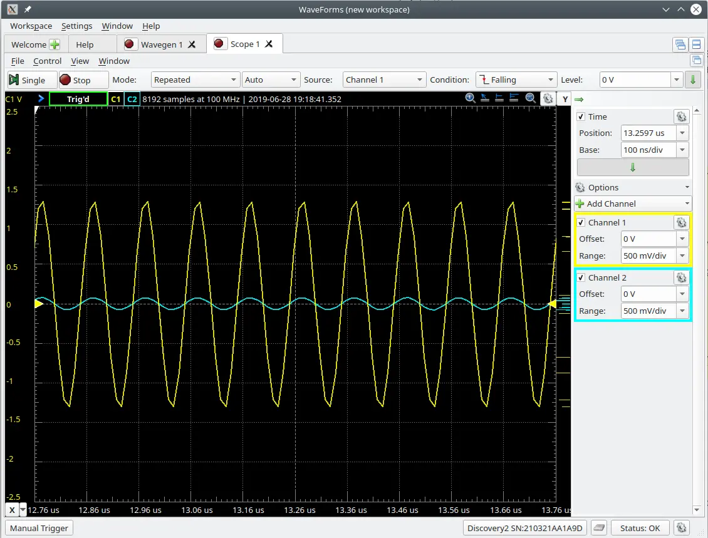

With the same image, one can also notice the significant change in the shape of the sine curve. This only tells me that either WaveGen or Oscilloscope or both cant be used in an environment which requires precision and accuracy. Another image showing the same phenomenon is bellow where a 1Hz frequency was sourced.
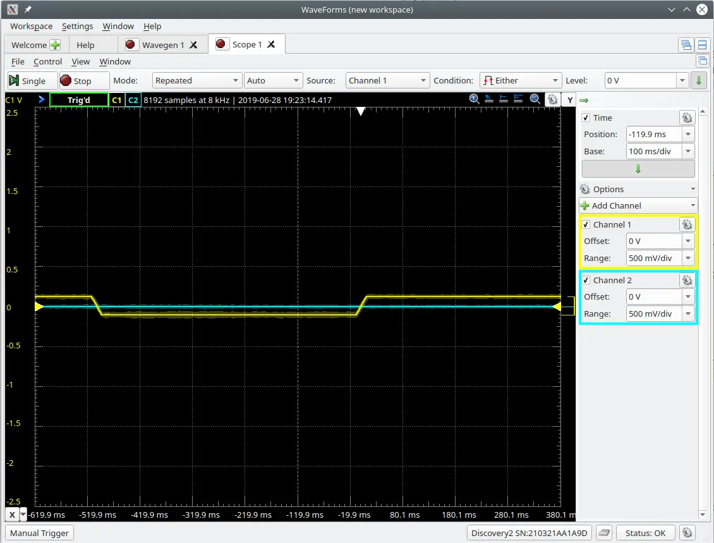

and in the following image where 17Hz is sourced on a 4 ohm speaker load.

 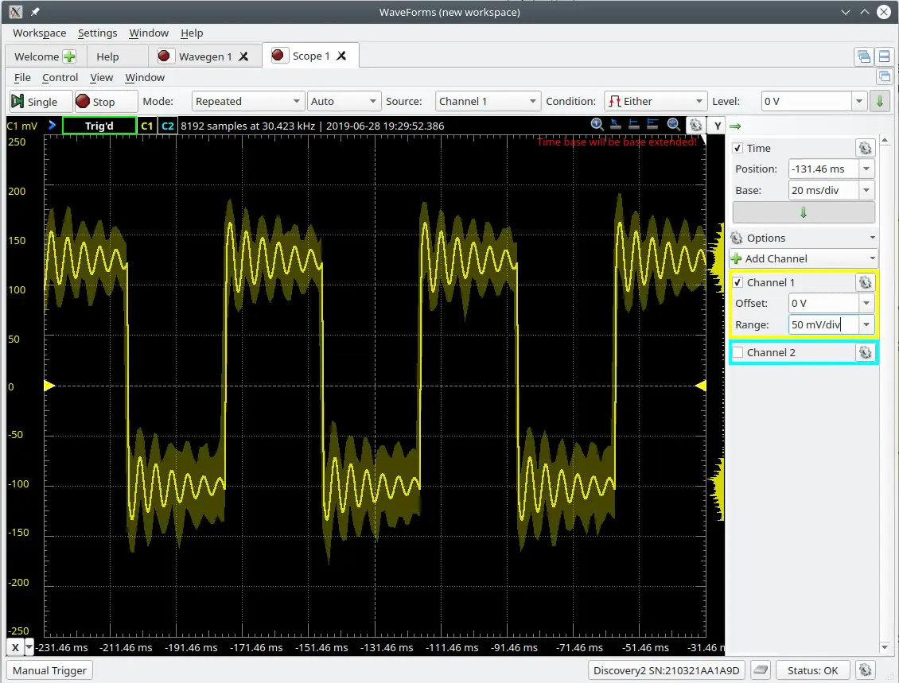

Another problem I faced a lot with my particular unit was frequent disconnection from the waveforms software but when checking the list of devices it is present. I suspect that the long cable provided with AD2 has considerable resistance and whenever AD2 draws some significant current through the laptop, the source voltage falls below the threshold and the device disconnects momentarily. This also posed a problem for me.

So with all these preliminary tests, I'm unsure of using AD2 to gather data for my research purpose. However ill do the VSM anyway just to see how it goes. I have already wound the 600 turn pickup coil whose signal will be captured by AD2 and the Fe sample is mounted on a 4 ohm speaker which will be driven by AD2 at 17Hz. Im just on the lookout for a suitable electromagnet. Earlier I thought of using AD2 to power a small diameter electromagnet, however, the magnetic field produced by it is around 10 Gauss, which is very small. The VSM would need at least 100 Gauss or above, which may be achieved by and external power supply circuitry whose strength can be controlled by some signal from AD2. Ill be sure to update this post as soon as I get some update

 

**Conclusion**

The Analog Discovery 2 can very well be called as the Swiss Army Knife of Test Equipments. Everything about it is really well documented and there are video tutorials to get you started too, so it's easy to figure out the whole capabilities of the device. The capabilities easily make this the best tool for learning and testing electronics for hobbyists to experienced. Its an extremely versatile tool to have in your lab shelf. However, this is certainly not a high-performance measurement unit, if you need accurate, precise and more control over the data acquisition or for research purpose, the device is not the go-to choice.

 

LabVIEW is no doubt the industry standard for interfacing instruments, however, its Graphical programming ideology sometimes gets messy and daunting to work with.

### Scoring

| **Product Performed to Expectations:**             | 6       |
| -------------------------------------------------- | ------- |
| **Specifications were sufficient to design with:** | 7       |
| **Demo Software was of good quality:**             | 10      |
| **Product was easy to use:**                       | 10      |
| **Support materials were available:**              | 10      |
| **The price to performance ratio was good:**       | 9       |
|                                                    |         |
| **TotalScore:**                                    | 52 / 60 |
