In this post, we’ll be making a simple IoT project. Web page controlled LED strip using NodeMCU connected on a local network.

## Outline:

Web page controlled LED strip is like the “Hello world” of IoT. In this post I will be detailing on the procedure I followed to set it up. The schematic of the project will be as follows:

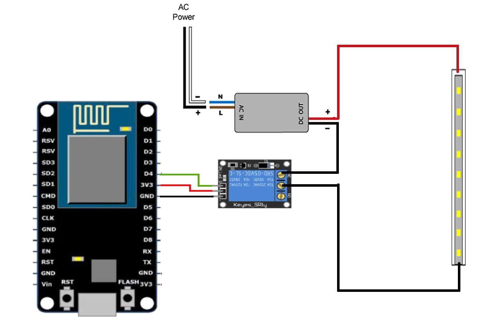

So when we click a button on a web browser we can turn the led strip on or off using a relay which we control using the ESP8266 board.

## Materials:

- NodeMCU

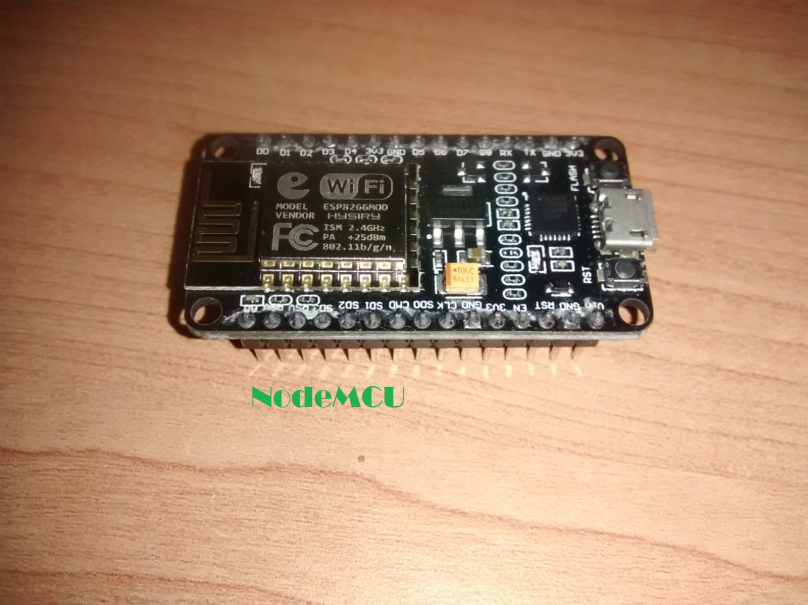

- 5v Relay

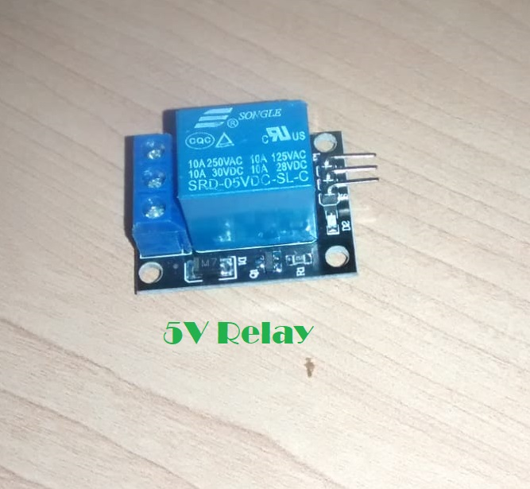

- LED strip
- LED strip power supply (any generic 12V power supply)

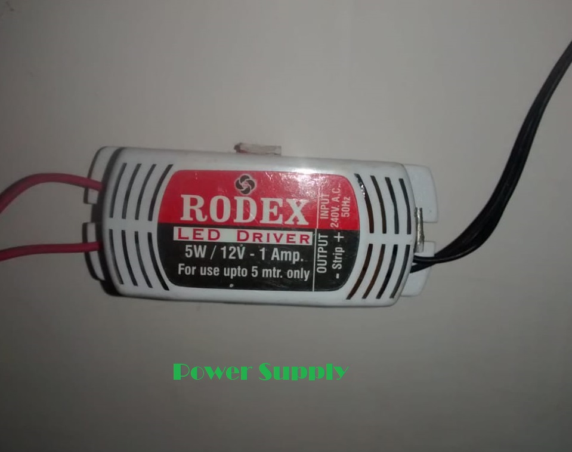


## Installing NodeMCU Board Package in Arduino IDE:

- Open up Arduino IDE. Go to Files-> Preferences. Enter `http://arduino.esp8266.com/stable/package_esp8266com_index.json` into Additional Board Manager URLs field.

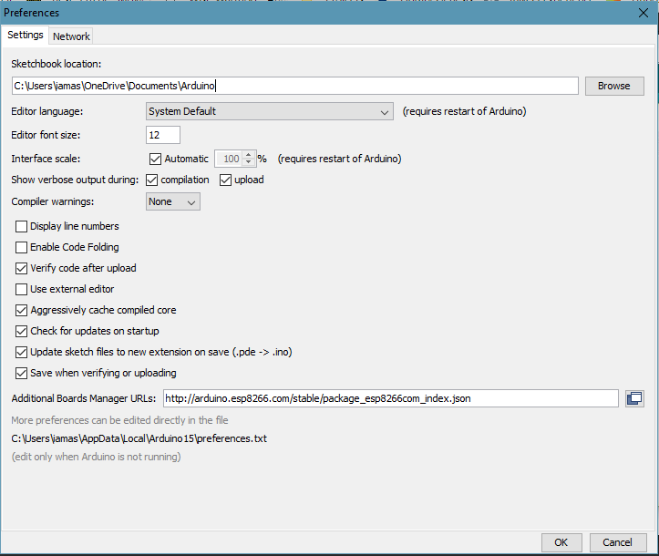

- Now go to Tools->Boards->Board Manager, and search for ESP8266 and install the package.

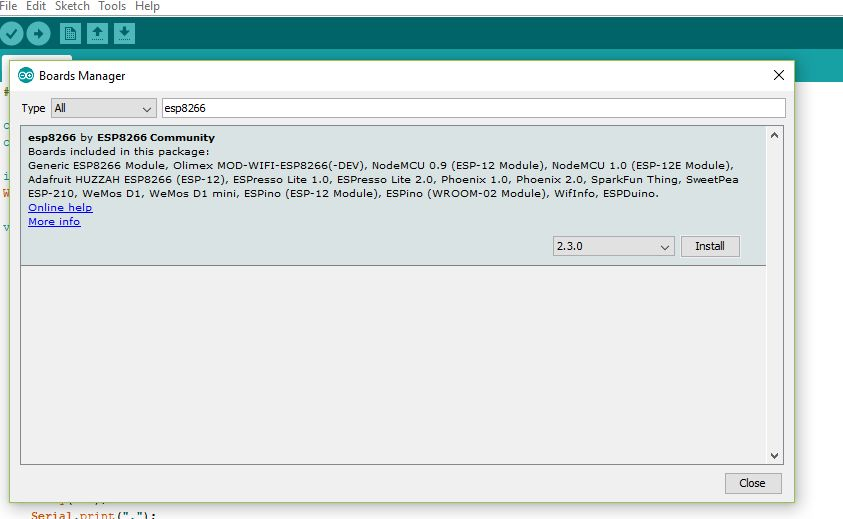

- If you have the same board as me (NodeMCU Amica) then you will have to install drivers for CP2102 (USB to Serial Converter)

  ```
  [Note: some board come with CH340G chip in which case you dont need to follow this step.]
  ```

  Download drivers from [here ](https://www.silabs.com/products/mcu/Pages/USBtoUARTBridgeVCPDrivers.aspx)and install it. Connect the nodeMCU to your computer and install the downloaded drives when your system prompts to install the drivers for the newly connected USB device.Go to the device manager of your computer and note down the COM port allocated to the newly connected USB device.

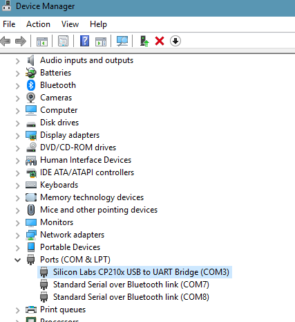

## Pin Connections:

Connect **NodeMCU** Ground (**GND**) pin to **-ve** pin of **Relay**.

Connect **NodeMCU** Supply (**Vin)** pin to **+ve** pin of **Relay**.

Connect **NodeMCU** Digital pin (**D0**) to **Input** pin of **Relay**.

## Coding Part

The code for the nodeMCU that I have uploaded is [here](https://raw.githubusercontent.com/iamashwin26/Projs/master/Introduction to IoT/Source_code_hello_IoT.ino) . Replace the line

```
WiFi.softAP("Hello_IoT", "ashwins12345678");
```

with whatever SSID and password you want to put.

```
NOTE. This sketch uses WiFi.softAP instead of the commonly used WiFi.begin, the reason is that when I use WiFi.begin() I can't find the SSID when I do WiFi scan, however, the SSID I do see is of the previous sketch where I used WiFi.softAP(). If you encounter the same problem while using WiFi.begin then using my code should fix it.
```

When u have successfully built your connection and the code, you have to upload the code into the NodeMCU by using a micro USB.

Now, go to Tools > Board > ESP8266 Modules and you can see many options for ESP8266. Select “NodeMCU 1.0 (ESP-12E Module). Next, select your port ( the same one you saw in the device manager previously ). If you cant recognize your port, go to the Control Panel > System > Device Manager > Port and update your USB driver.

Now upload the code to the board.

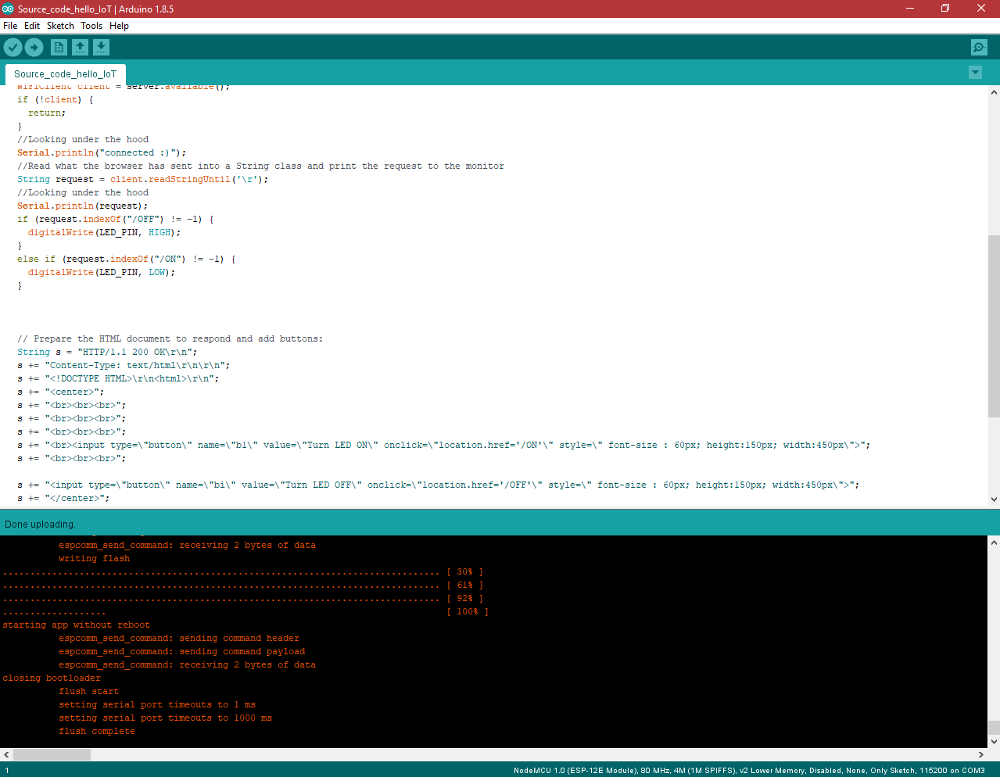


## Finale testing:

- Now open up your Serial Monitor, and note down the URL.

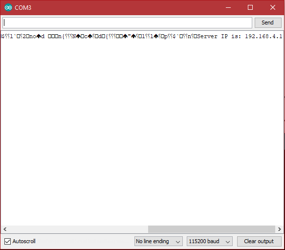

- Now put the URL in your phone’s browser( it usually defaults to 192.168.4.1).
- A page will open having two buttons ON and OFF.

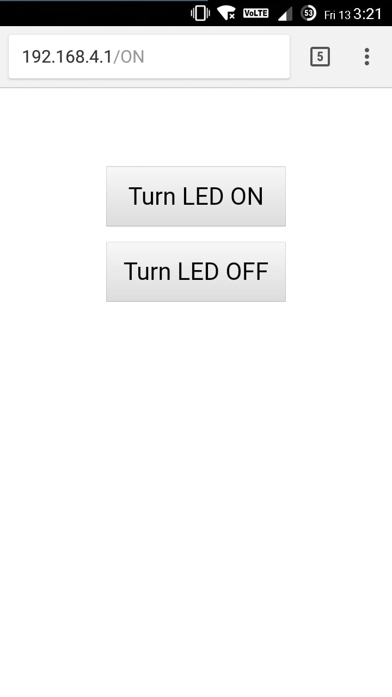

- If everything is correct when you press ON the LED will light up and when you press OFF the LED will turn off.

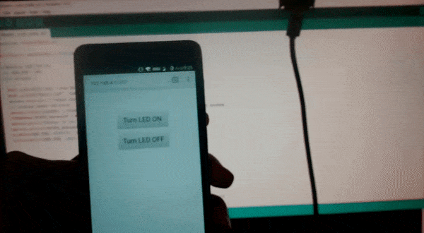

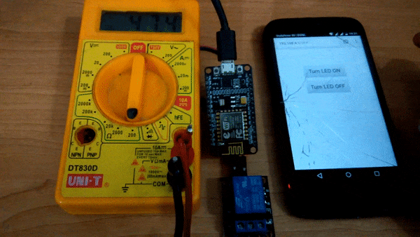

## Final Connections:

Now that we know our code and setup works let’s connect the relay to the led strip power source as shown in the figure in the outline section.


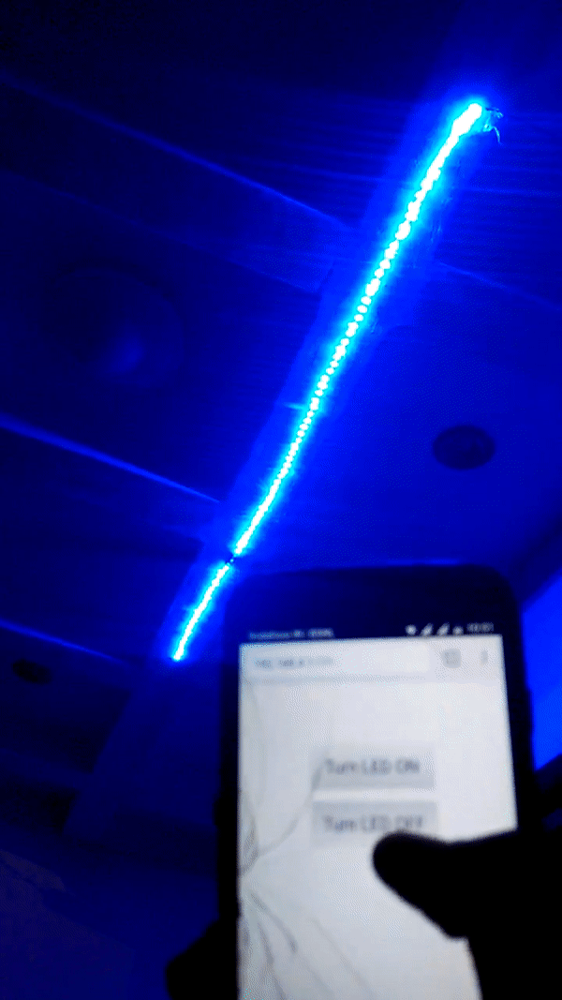

 

Vola! there’s our first project!

## Whats next?

We can add more feature to the project such as making it connect to a wifi router so that you can access the LED strip from anywhere in the world. We can convert this project to use the barebone ESP8266 and FTDI programmer. We can use the power supply of the LED strip to power the ESP8266 (Not recommended since most LED power supply have high AC noise as I found out in my case and hence can damage the ESP8266 board).Add more devices for the ESP to control and much much more! All that
