---
Title:Notes on Superconductivity
Date: 2019-06-06
Modified:2019-06-20
category: Lecture Notes
Tags: Superconductivity, spin, cooper pairs
Slug: Superconductivity
Summary: Short note on superconductivity
---
[TOC]
This post is my notes on Superconductivity from video lectures of [Sergey Frolov](https://www.youtube.com/channel/UCDBKb7qMyNXujTf7kKRdstg "Youtube Link") on Solid State Physics and other online sites such as http://www.superconductors.org

# Properties

- Discoverd first in Hg at 4.2K in Liquid Helium

- Current induced in a ring follows $$ I(t)=I_0e^{(-t/\tau))}$$ and dosent change much for over 100,000 years for SC and goes to 1% of initial value in few nano seconds in a normal metal.

- Magnetic field destroy super conductivity (so does current in the SC)
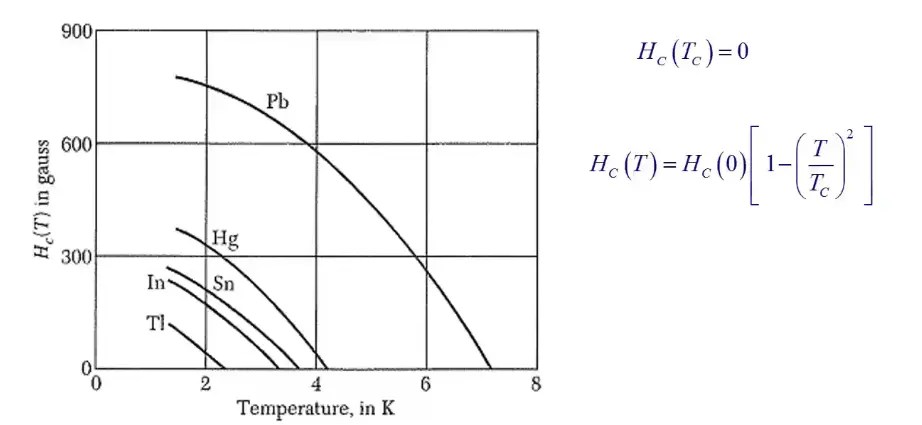

- Magnetic Impurities lower $T_C$ (non mag has no effect)

- Fe Co Ni nonSC

- CU Ag Au nonSC

- 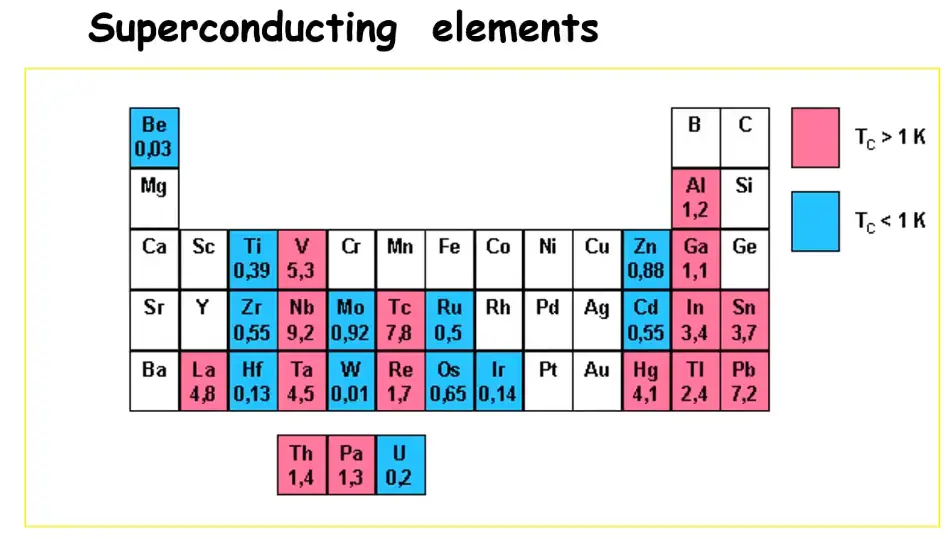

- Si becomes SC at high Pressure

- Conventional and unconventional SC

- most unconventional SC has C,O atoms in  pervoskite structure.

- 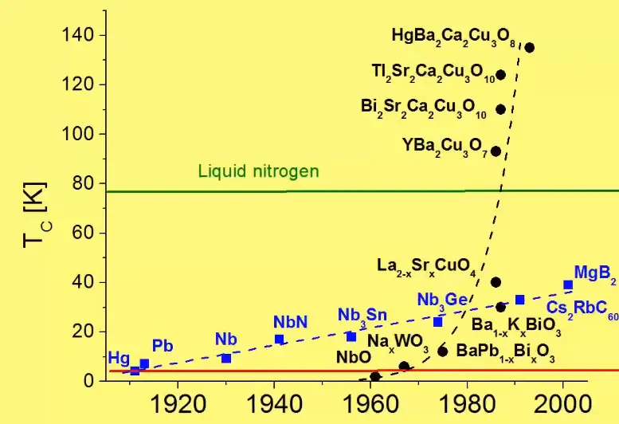

- *Meissner effect* is perfect expulsion of Magnetic field out of SC (except penetration depth) due to screening current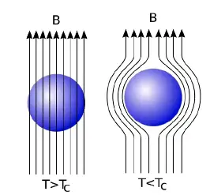

- SC act as perfect diamagnet $\chi=-1$ and is a defining feature of SC and not just $\rho$=0

- Difference between perfect conductor and SC 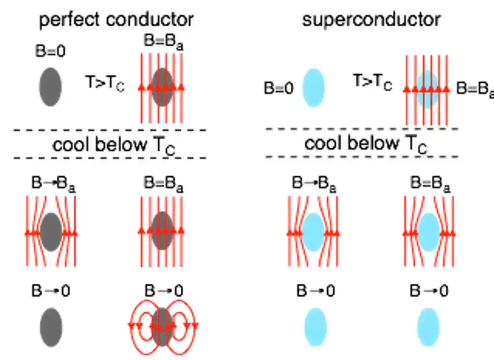

- The esseence of meissner effect is that SC **alaways expels the magnetic field**

- There are three tests, that are considered the gold standard for superconductivity,

  1) the drop in resistance below a critical temperature threshold, 

  2) replacing elements in the material with heavier isotopes to observe a corresponding drop in superconductivity temperature.

  3) [Meissner effect](https://en.wikipedia.org/wiki/Meissner_effect): As the material passes below the critical temperature and transitions into superconductivity, it ejects its magnetic field.

- Heat capacity of a SC is discontinuous at $T_C$ and crashes to 0 after  $T_C$
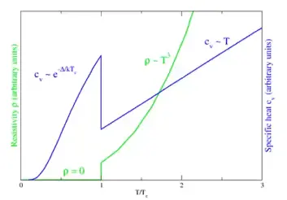

- The function is given by $C \alpha e^{a/T}$ and is simmilar to Einstein's model of specific heat, n coupled osscilator model. 

- [verify !] Exponents often go with gaps (semiconductor and superconductor state)

- In the super conducting state, there is a samll energy gap arround the fermi level. With $E_g~10x^{-4}E_F$
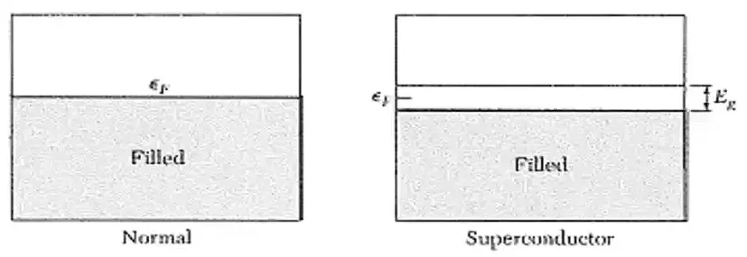

- one in 10,000 electrons participate in SC state.

- The a in $C \alpha e^{a/T}$ is given by $-E_g/2$

- Higher $E_g$ implies higher $T_C$
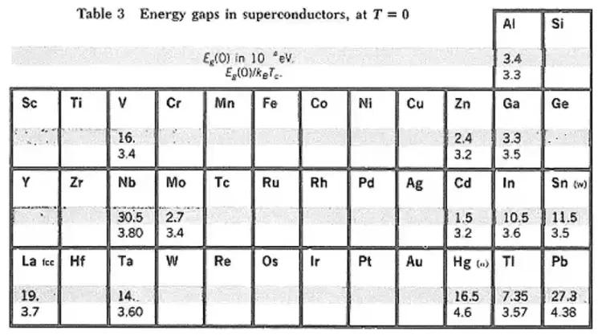

- Nb has the higest gap of all the materials.

## Applications

- Super conducting single photon detector telescope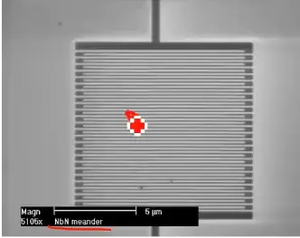{width=50%}
- Quantum computer with photons.
- **Levitating high speed trains(~600 km/h)**: Transport vehicles such as trains can be made to "float" on strong superconducting magnets, virtually eliminating friction between the train and its tracks.This reduces the heat generated and size occupied as compared to regular electromagnet. A landmark for the commercial use of MAGLEV technology occurred in 1990 when it gained the status of a nationally-funded project in Japan. The Minister of Transport authorised construction of the Yamanashi Maglev Test Line which opened on April 3, 1997. In April 2015, the MLX01 test vehicle attained an incredible speed of 603 kph.
- **MRI**: By impinging a strong superconductor-derived magnetic field into the body, hydrogen atoms that exist in the body's water and fat molecules are forced to accept energy from the magnetic field. They then release this energy at a frequency that can be detected and displayed graphically by a computer.
- NMR,
- **SQUID** **(Superconducting QUantum Interference Device)**: SQUID's are capable of sensing a change in a magnetic field over a billion times weaker than the force that moves the needle on a compass (compass: 5e-5T, SQUID: e-14T.). With this technology, the body can be probed to certain depths without the need for the strong magnetic fields associated with MRI's. SQUIDS are being used by the U.S. NAVY to detect mines and submarines. 
- **High efficiency generators:** Electric generators made with superconducting wire are far more efficient than conventional generators wound with copper wire. In fact, their efficiency is above 99% and their size about half that of conventional generators.
- Essen, Germany has the world's longest superconducting power cable in production at 1 kilometer. It is a 10 kV liquid nitrogen cooled cable. The cable is smaller than an equivalent 110 kV regular cable and the lower voltage has the additional benefit of smaller transformers.

# Superfluidity of He

- Zero viscocity

- Measurement show the 0 resistance to flow of He 
- ie the flow velocity of liquid helium is independent of applied pressure.
- in semicunductor attraction between $e^-$ in conduction band and holes in valence bond give rise to a bound pairs known as excitons , they also show super fluidity.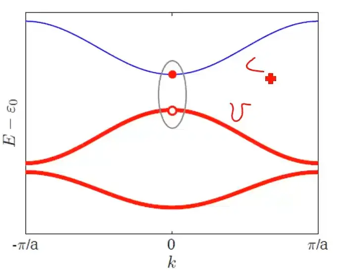

- Because they contain real bound pairs of 2 fermions (in contrast to cooper pais) excitons are bosons.
- as a result it is possible for them to form a Bose-Einstein condensate, a superfluid that can flow withoutt resistance
- (this does not give rise to superconductivity as excitons are incharged

# Why is there superconductivity?
tldr: Two electrons form a bound state called Cooper pair. These cooper pairs form a condensate.
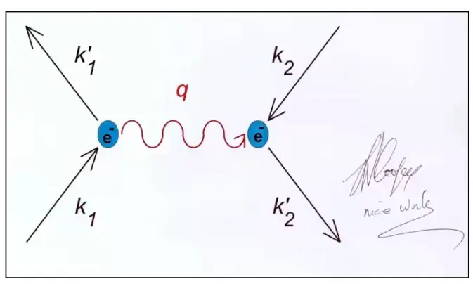

When an electron is moving through a solid with momentum K, since it also interacts with the lattice, there is an electron phonon interaction, meaning an electron moving through the crystal launches a phonon, another electron flying in a different direction can absorb this photon and form a bound state. These cooper pairs form a condensate (they are all in the same indistinguishable quantum state). And the condensate can be represented by the wave function $\psi=n_s e^{i \phi}$, where $n_s$ is the density of Cooper pair and $\phi$ denotes the phase.

# London equations

The London equations, developed by brothers Fritz and Heinz London in 1935 relate current to electromagnetic fields in and around a superconductor.

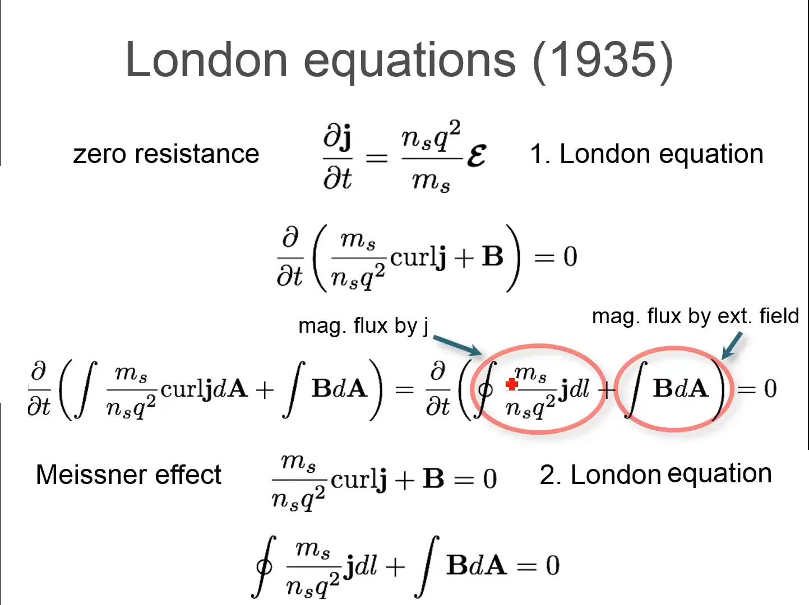

- In ohms law $j=\sigma E$ so its differential wrt time is 0, however 1st london equation gives a non 0 relation with $j'$ and $E$ .

- In leq1, $j$ is the superconducting current density, E and B are respectively the electric and magnetic fields within the superconductor, $q$ is the charge of an electron & proton, m, is electron mass, and $n_s$, is a phenomenological constant loosely associated with a number density of superconducting carriers.

- London eqn 1 (le1) also means that particles in a super conductor accelerate when a voltage is applied, in normal metals they only move with drift velocity and 0 acceleration.

- taking curl on both side of le1 and using Maxwell equations you get the second form of le1. This when integrated over an area, you get the le2.

- The rationale for the le1 can be thought of in the following different ways: 

  1) By definition, the electrons in a superconductor flow with no resistance, hence one can  imagine electrons as if they were free electrons und er the influence of a uniform external electric field. According to the Lorentz force law $F=eE+ev\mathrm{x}B$ these electrons should encounter a uniform force, and thus they should in fact accelerate uniformly. This is precisely what the first London equation states.

  2) Current density is defined according to the equation $j=-n_s e v$ , Taking this expression from a classical description to a quantum mechanical one, we must replace values j and v by the expectation values of their operators. The velocity operator $ v = (p+eA)/m$ is defined by dividing the gauge-invariant, kinematic momentum operator by the particle mass *m*. we are using  as the electron charge. We may then make this replacement in the equation above. However, an important assumption from the microscopic theory of superconductivity (BCS) is that the superconducting state of a system is the ground state, and according to a theorem of Bloch's,[[\]](https://en.wikipedia.org/wiki/London_equations#cite_note-Michael_Tinkham_1996_5-10) in such a state the canonical momentum **p** is zero. This gives us $j=-\frac{n_s e^2}{m}\textbf{A}$ which is loosely the le1

- 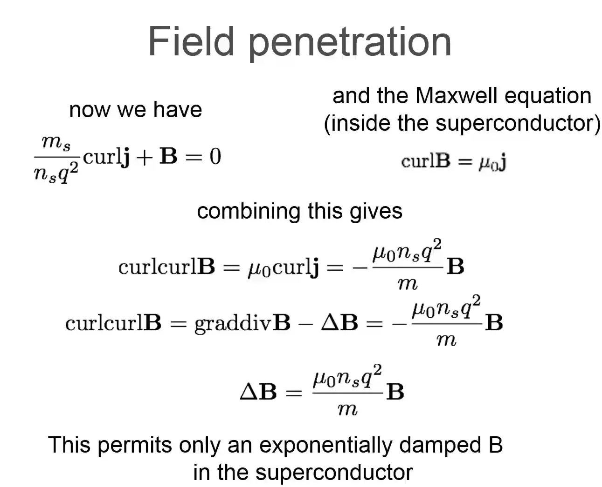

- The solution for that differential equation is ${ \nabla ^{2}\mathbf {B} ={\frac {1}{\lambda ^{2}}}\mathbf {B} ,\qquad \lambda \equiv {\sqrt {\frac {m}{\mu _{0}n_{s}e^{2}}}}.}$

- 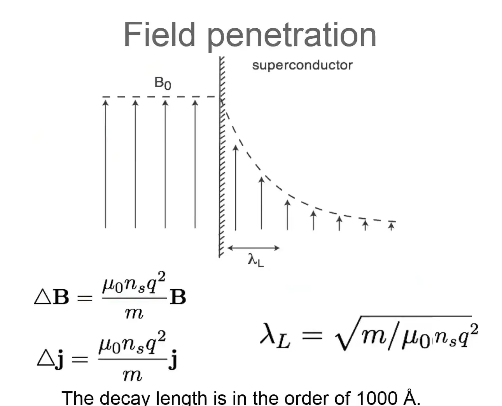

# Superconductivity in the bulk : Cooper pairs

- electron-phonon interaction leads to an attraction of electrons

- Cooper pairs: bound states of two electrons with opposite momentum and spin.

- size of cooper pair is characterised by coherence length $\xi = \frac{\hbar v_F}{\pi \Delta} $ electrons greater than this length cant form pairs

- the net spin is zero so they obey Bose-Einstein statistics: at low T all pairs condense in the lowest state (no Pauli exclusion !) and hence they are Bosons

- The gap in the diagram is the Superconducting energy gap, X-axis is the energy, 0 is the fremi level.

-  Here, the size of the energy gap indicates the energy gain for two electrons upon formation of a Cooper pair

- If a conventional superconducting material is cooled from its metallic state (at higher temperatures) into the superconducting state, then the superconducting energy gap is absent above the critical temperature $T_{c}$, it starts to open upon entering the superconducting state at $T_{c}$, and it grows upon further cooling.

- In the \Delta$   there are only cooper pair condensate and outside there are only unbound electrons.

-  BCS theory predicts that the size $\Delta$  of the superconducting energy gap for conventional superconductors at zero temperature scales with their critical temperature $\Delta (T=0)=1.764\,k_{B}T_{c}$ .

- The density of states is $N_s(E)=N_N(E) E/(E^2- D^2)^{0.5}$

- The super conducting state can be describes with a singel macroscopic wave function $\Psi=\sqrt(n_s)e^{i \phi}$ with$n_s$ is the density of the cooper pairs, $\phi$  phase of the condensate.

- So how does the electron pairing occur? consider the crude model:

  

- 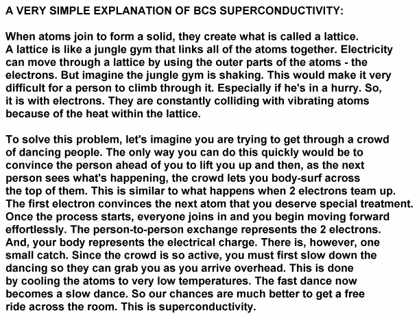

- 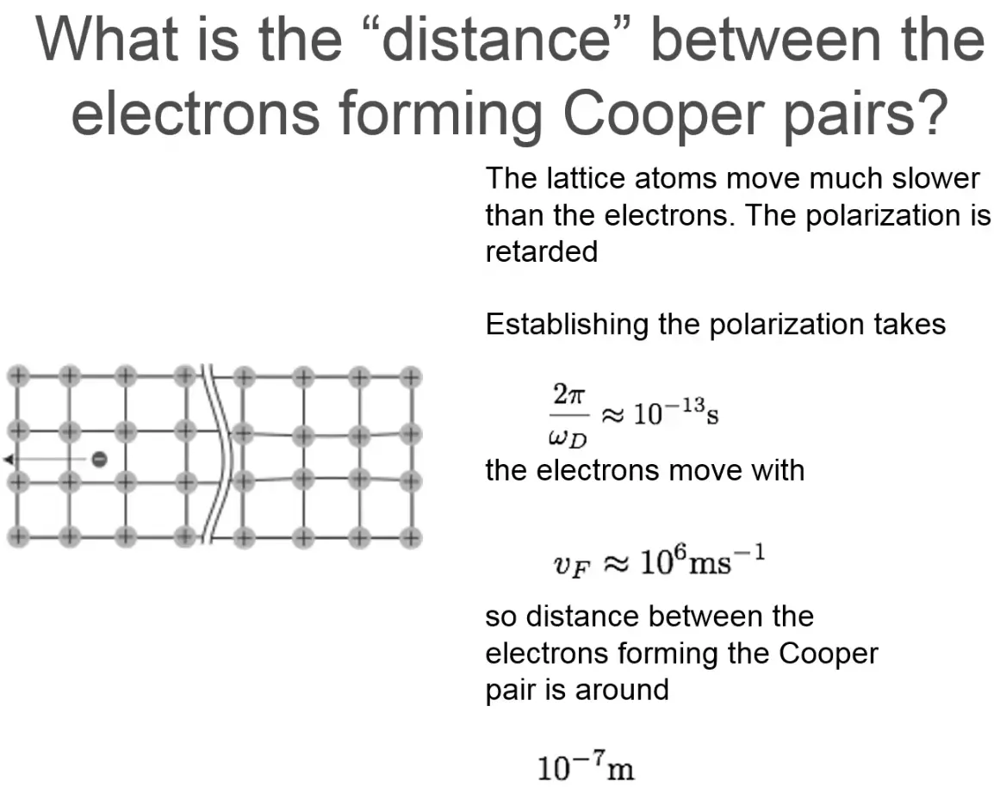

- in the above picture, $\omega_D$ is the **Debye** relaxation **time**

- 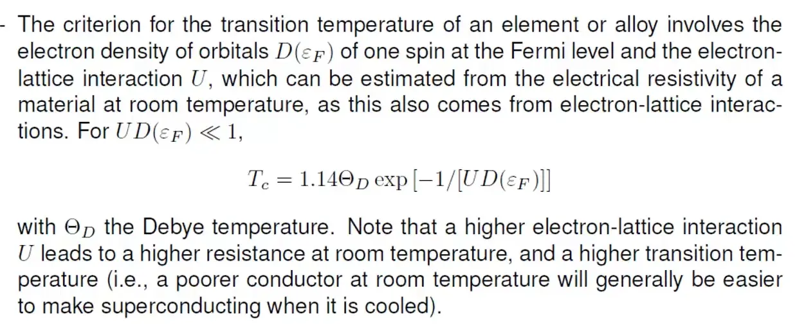

- 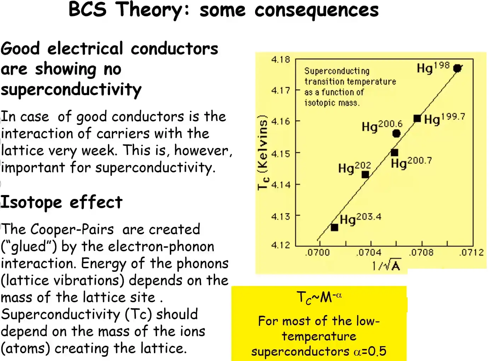

- Spin singlet nature of cooper pairs were confirmed with NMR measurements

- Ferromagnetic materials are not super conduction since they cant support pairs of electrons with opposite spins (Explained by BCS)

  

# Superconductor terminology

  The following content on superconductor terminology  is largely derived from  http://www.superconductors.org/terms.htm with some modifications.

- **Anneal**: To heat and then slowly cool a material to reduce brittleness. Annealing of ceramic superconductors usually follows sintering and is done in an oxygen-rich atmosphere to restore oxygen lost during sintering. The oxygen content of a ceramic superconductor is critical. For example, YBCO with 6.4 atoms of oxygen will not superconduct. But YBCO with 6.5 atoms will. {width=150px}

- **Anti-ferromagnetism:** A state of matter where adjacent ions in a material are aligned in opposite or "anti-parallel" arrays. Such materials display almost no response to an external magnetic field at low temperatures and only a weak attaction at higher temperatures. There is evidence that anti-ferromagnetism in the copper oxides plays a role in the formation of Cooper pairs and, thus, in facilitating a superconductive state in some compounds. 
  {width=150px}

- **BCS Theory**: The first widely-accepted theory to explain superconductivity put forth in 1957 by John Bardeen, Leon Cooper, and John Schreiffer. The theory asserts that, as electrons pass through a crystal lattice, the lattice deforms inward towards the electrons generating sound packets known as "phonons". These phonons produce a trough of positive charge in the area of deformation that assists subsequent electrons in passing through the same region in a process known as phonon-mediated coupling. This is analogous to rolling a bowling ball up the middle of a bed. 2 people, one lying on each side of the bed, will tend to roll toward the center of the bed, once the ball has created a depression in the mattress. And, a 2nd bowling ball, placed at the foot of the bed, will now, quite easily, roll toward the middle. 

- **Borocarbides**: Superconducting borocarbides are compounds containing both boron and carbon in combination with rare-earth and transition elements; some of which exhibit the unusual ability to return to a normal, non-superconductive state at temperatures below Tc. 

- **BSCCO**: An acronym for a ceramic superconductor system containing the elements Bismuth, Strontium, Calcium, Copper and Oxygen. Typically, a small amount of lead is also included in these compounds to promote the highest possible Tc. BSCCO has probably found the widest acceptance among high-Tc superconductor applications due to its unique properties. BSCCO compounds exhibit both an intrinsic Josephson effect and anisotropic (directional) behavior. 

- **Ceramics**: Ceramic superconductors are inorganic compounds formed by reacting a metal with oxygen, nitrogen, carbon or silicon. The best-known of these are the copper-perovskites. Ceramics are typically hard, brittle, heat-resistant materials formed by a process known as solid-state reaction.

- **Charge Reservoirs:** In superconductors, charge reservoirs are the layers that may control the oxidation state of adjacent superconducting planes (even though they themselves are not superconducting). In the layered cuprates, these consist of copper-oxide chains. 

  

  
